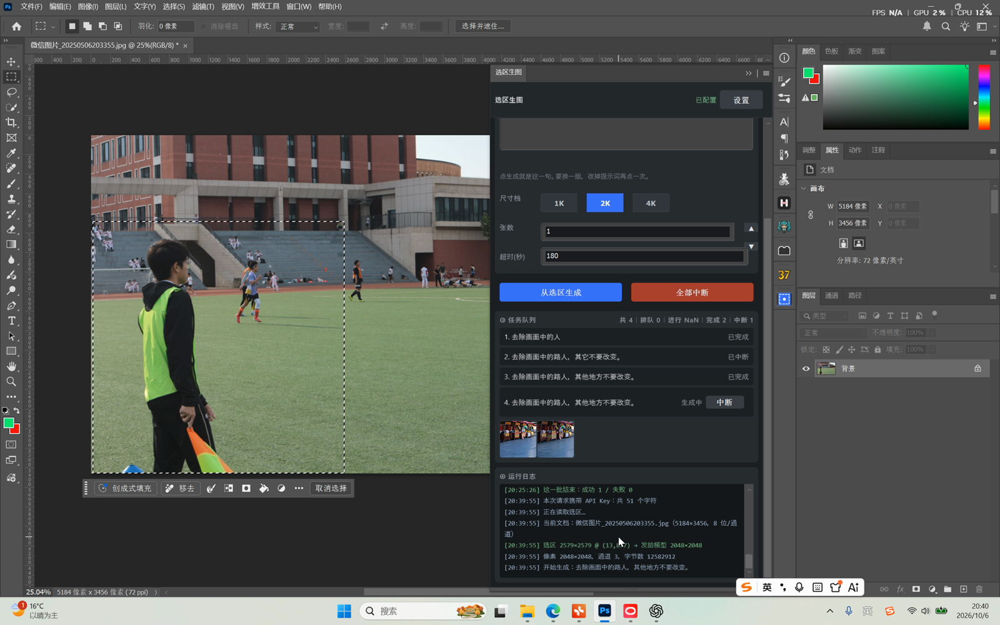
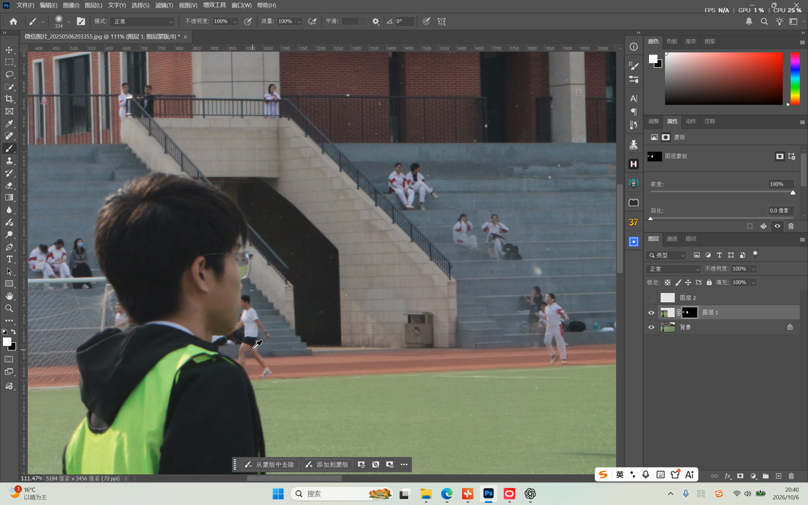
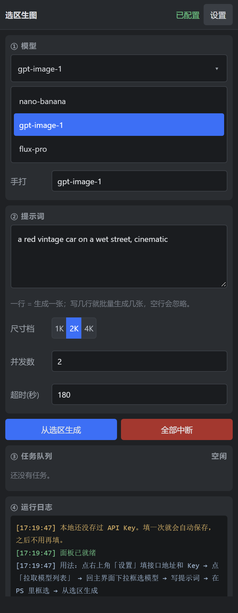
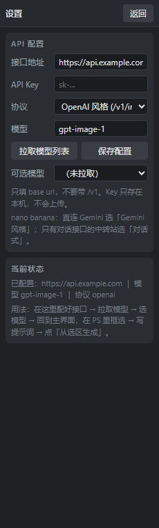

# 选区生图（Photoshop UXP 插件）

一个极简的 Photoshop 插件：**框一个选区 → 写提示词 → 调用生图接口 → 结果自动贴回选区位置**。
没有登录、没有账号、没有云端依赖，配置一次 API 就能用。

> 状态：主链路已在 Photoshop 2026 上真机跑通——面板加载、读选区、抓像素、调接口生成、
> 结果缩放贴回新图层都正常；纯逻辑部分有自动化测试（150 项 + 14 项清单自检）。
> 演示录屏：<https://github.com/arr1chino/ps-selection-gen/releases/download/v0.2.0/demo.mp4>
> 逐项验证结果（含没跑通的那一项）见文末「真机验证结果」。

## 来源说明

本工程的**代码为独立实现**，没有复制任何第三方工程的源码。

参考插件：sdppp、hhps。

哪些是参考的思路、哪些是自己重新设计的，见文末「与参考工程的关系」一节。

---

## 它能做什么

| 功能 | 说明 |
| --- | --- |
| 配置 API | 填接口地址 + Key，Key 只存本机（填完自动保存，下次不用重填） |
| 拉取模型 | 在「设置」里一键拉取，只留下能生图的模型（纯文字模型会被滤掉），回主界面下拉框选 |
| 提示词 | 一次一条，配一个「张数」。张数设几张，就用这一句生成几张 |
| 选区生成 | 读取当前文档的选区边界的画面内容，发给模型 |
| 自动贴回 | 结果自动缩放并对齐到选区左上角，落在新图层上（可一次撤销） |
| 自动编组 | 这一批的结果自动收进一个组「生图结果」，组上带一块白色蒙版（画面不变，想遮挡时直接在蒙版上涂黑） |
| 张数 | 一句提示词生成几张（1–8）。多个请求并行发出去，Photoshop 操作串行排队，互不打架 |
| 提前截断 | 「全部中断」一键停掉所有未完成请求；每个任务也能单独中断 |

## 界面预览

### 实机（Photoshop 2026）

框好选区、点「从选区生成」之后的面板。左边画布上是选区（2579×2579，缩放成 2048×2048 发给模型），
右边是任务队列（4 条：完成 2、中断 1、生成中 1）和运行日志：



生成完的结果落在新图层上，位置和尺寸对齐到选区，一次可撤销：



从框选到贴回的完整录屏（84 秒，4.8 MB）：
<https://github.com/arr1chino/ps-selection-gen/releases/download/v0.2.0/demo.mp4>

### 界面预览（浏览器渲染）

主面板只留每次生成都要碰的东西（模型、提示词、尺寸档 / 张数 / 超时），
接口地址和 Key 收在右上角的「设置」里：



设置页——只有接口地址、Key、协议，配一次就不用再动：



> 说明：上面这两张是按 360px 面板宽度在浏览器里渲染的**界面预览**（UXP 面板用的就是 HTML + CSS 子集），
> 不是 Photoshop 里的实机截图——实机请看本节开头的两张截图和录屏。

## 目录结构

```
ps-selection-gen/
├─ manifest.json          Adobe UXP 插件清单（权限、入口、图标）
├─ index.html             面板界面（原生 UXP 面板，没有套 webview）
├─ index.js               入口：把 UI 和下面的模块接起来
├─ src/
│  ├─ util.js             零依赖工具（base64、UTF-8、图片格式嗅探、尺寸取整）
│  ├─ store.js            配置持久化（普通配置走 localStorage，Key 加密存储 + localStorage 双写）
│  ├─ api.js              生图接口对接（三种协议族 + 模型列表 + 尺寸换算 + 字段降级重试）
│  ├─ photoshop.js        Photoshop 交互（读选区、抓像素、贴回图层）
│  ├─ ps-commands.js      发给 Photoshop 的那几条命令（可脱机测试的纯数据）
│  ├─ queue.js            并发池 / PS 串行锁 / 任务表
│  └─ pipeline.js         一次批量生成的完整流程编排
├─ test/test-core.js      不依赖 Photoshop 的纯逻辑测试（150 项断言）
├─ test/test-manifest.js  清单自检（14 项，防清单写坏导致插件整个消失）
├─ tools/                 Windows 辅助脚本
├─ CHANGELOG.md           版本更新日志
└─ icons/                 插件图标（icon@1x.png / icon@2x.png 两种尺寸）
```

## 跑测试

不装 Photoshop 也能验证一半逻辑（base64、UTF-8、图片格式嗅探、尺寸换算、模型过滤）：

```
node test/test-core.js
node test/test-manifest.js
```

期望 150 项 + 14 项 `ok`、0 项 `FAIL`。

## 怎么装进 Photoshop

要求 Photoshop 24.2 以上。

1. 完全关闭 Photoshop。
2. 把整个包解压放进 Photoshop 安装目录下的 `Plug-ins` 文件夹（解压出来的文件夹里要能直接看到 `manifest.json`）。
3. 打开 Photoshop，菜单 `增效工具 → 选区生图`。

卸载就是删掉 `Plug-ins` 里的这个文件夹。

改完代码要**完全退出 Photoshop 再打开**，只关面板不会重新加载插件。

## 怎么用

接口配置和日常生成是分开的两页：主面板只管"写词、开跑、看结果"，
接口地址和 Key 这类**配一次就不用再动**的东西全在「设置」里。
模型是每次生成前都可能换的，所以放在主面板第一块。

**第一次用，先配接口（只做一次）**

1. 点右上角 **设置**。
2. 填接口地址（只填到域名，**不要**带 `/v1`）、填 Key、选协议。
3. 点 **拉取模型列表**：插件会拉一遍可用模型，**自动滤掉纯文字模型**，只把能生图的留下。
   拉取结果会存下来，重启面板也还在，不用每次重拉。
4. 点 **保存配置**（Key 其实离开输入框就自动存了，点一次是保存地址和协议），再点 **返回** 回到主界面。
5. 回到主界面最上面 **① 模型**：点那一行会展开下拉列表，里面就是上一步筛出来的生图模型，点一个即选中。
   列表里没有想要的模型，就用下拉框里的 **手打** 输入框自己填模型名，回车生效。

选好之后，收起状态那一行显示的就是当前模型；右上角的状态条会显示「已配置」；没配好也会明确提示。
Key 只存在本机，不会随项目上传；面板重开、Photoshop 重启都不用再填一次。

**日常生成**

6. **② 提示词**：在 PS 里用矩形选框工具（M）框出要重绘的区域，然后写**一句**提示词，
   右边的「张数」是这句要生成几张。想换一版，改掉提示词再点一次生成。
   **③** 是任务队列，**④** 是运行日志。
7. 点 **从选区生成**。跑的过程中可以随时点「全部中断」。

---

## 支持哪些接口

设置里的「协议」有三个选项，对应三种调用形状。选错了不会炸，但会报 404 或 400，
所以底下写清楚各自适用什么：

| 协议 | 实际请求 | 适合 |
| --- | --- | --- |
| OpenAI 风格 | `POST {base}/v1/images/edits`（multipart） | 标准 OpenAI 图像接口、大部分中转站的 `gpt-image-1` / `flux` / `seedream` 等 |
| Gemini 风格 | `POST {base}/v1beta/models/{model}:generateContent` | 直连 Gemini 官方接口，`inlineData` 传参考图，`imageConfig` 控制比例与档位 |
| 对话式 | `POST {base}/v1/chat/completions` | 只在对话接口里提供出图能力的模型，尤其是中转站上的 nano banana |

### nano banana 的情况

nano banana 指 `gemini-2.5-flash-image` / `gemini-3-pro-image` 这一系。
它有三种常见接法，插件里都覆盖了：

1. **直连 Gemini**：选「Gemini 风格」，请求按 `generateContent` 发，
   选区图放在 `inlineData`，出图尺寸走 `imageConfig`（档位 + 比例）。
2. **中转站的对话接口**：选「对话式」，图片放在 `messages[].content[].image_url`，
   返回的图从 `choices[0].message.images[]` 里取（数据 URL 会自动剥掉前缀，外链会自动下载）。
3. **中转站的图片接口**：有些站把它也挂到 `/v1/images/edits` 上，那就选「OpenAI 风格」。

另外做了一层**字段降级重试**：不同模型对可选字段的容忍度不一样
（比如有的收到 `imageConfig` 直接回 `Unknown name "imageConfig"`，有的不认 `modalities`）。
这类报错会被识别出来，自动去掉那个字段重发一次；鉴权失败、限流、内容拦截则原样报错，不浪费请求。

比例只从模型真正接受的那几个里选（`1:1` `4:3` `3:4` `3:2` `2:3` `16:9` `9:16` `5:4` `4:5` `21:9`），
就近取一个，避免框一条细长选区就吃到 400。

> 以上是按各家公开接口形状整理的。真机上真实调通的是**走中转站**的那几条路（开发过程中
> 撞出过 400 `Unknown name "imageConfig"`、图被当成正文发回来、401 漏带 Key 这些真问题，都据此修掉了）；
> 「直连 Gemini 官方域名」这条保留在代码里，没有单独实测过。

---

## 设计说明（也是给评审看的那份）

### 需求是怎么定的

市面上的 PS 生图插件普遍有两类问题：

- 功能大而全，参数面板几十个选项，日常只想"框一块地方重画一下"的人根本用不上；
- 绑死某一个后端（要么只能接本地 ComfyUI，要么只能接某一家云服务）。

所以这个版本只做三件事：**配置一个接口、框一个选区、把结果贴回去**。其余全部砍掉。

### 砍了什么，为什么

没有登录、没有账号体系、没有磁贴/分组/主题引擎、没有卫星插件 IPC、没有音效、
没有内置教程站、没有多后端预设包。理由是这些都不影响"框选 → 生成 → 贴回"这条主链路，
但每一个都会显著增加代码量和出 bug 的面。

### 几个关键的实现取舍

**1. 不用 webview 套壳。**
面板直接就用 UXP 原生面板（HTML + CSS 子集）。
少一层 `<webview>`，就少了"前端 ↔ 宿主"那套 postMessage 消息桥，
UI 和 Photoshop 调用在同一个上下文里，直接函数调用即可，调试路径短一大截。
代价是界面只能用 UXP 支持的 CSS 子集，做得朴素一些。

**2. 让 Photoshop 自己当解码器和缩放器。**
生图接口返回的是 PNG 或 JPEG 的 base64，要落到图层上就得先变成像素。
在 JS 里手写 PNG/JPEG 解码器是最容易踩坑的一步，所以改成：

```
base64 → 写临时文件 → app.open() 让 PS 解码
        → imaging.getPixels({ targetSize: 选区尺寸 })   ← 顺手让 PS 做缩放
        → 关掉临时文档 → 新图层 → imaging.putPixels({ targetBounds: 选区左上角 })
```

好处是插件里**一行解码代码都没有**，缩放精度也由 Photoshop 保证。
`putPixels` 带的 `commandName` 会让它落进历史记录里，所以贴回是**一次可撤销**的操作。

**3. 编码交给官方 API。**
把像素转成能发出去的图片，用的是官方的 `imaging.encodeImageData`，
不自己拼 JPEG/PNG 编码器。
代价是得先顺着它：JPEG 不接受带透明通道的数据，而部分 Photoshop 版本即使写了
`applyAlpha: false` 也照样返回四通道像素，直接扔进去会被顶回来
（`Image data with alpha cannot be encoded as jpeg`）。
所以编码前会先把像素**手工拆成 8 位、无 alpha 的 RGB**，再交给官方编码器——
拆像素是十几行循环，跟手写一个 JPEG 编码器不是一个量级。

**4. 抓图和贴回都落在新图层上，不动原图层。**
每次生成的结果都是一个新的像素图层，原始内容永远不被覆盖，不想要了直接删图层。

**5. 多个请求并行、PS 串行。**
生图是慢在网络上，所以「张数」设 3 就三个请求一起飞；
但 Photoshop 的文档操作不能并发调用，否则互相打架，
所以"贴回"这一步统一走一个串行队列。

**6. 提前截断分两级。**
`AbortController` 按任务分组登记：
「全部中断」会中断所有在跑的请求并清空等待队列；
每个任务右侧的「中断」只掐掉那一个，已经完成的结果保留不动。

### 已知限制

- **只支持矩形选区。** 不规则选区目前会把整个外接矩形的结果贴回去。
  下一步要做的是把选区当图层蒙版用，让溢出部分被裁掉。
- **只支持 8 位/通道文档。** 16/32 位会先转成 8 位再处理，画质有损。
- **贴回是缩放对齐，不是内容感知融合。** 结果和原图的接缝处需要自己再修。
- **尺寸换算依赖各家中转站的实现**，不同服务商对 `size` / `aspectRatio` 的支持程度不一样。
- 临时文件用完即删；如果插件中途崩了，`系统临时目录/selgen_*.png` 可能残留。

## 真机验证结果

在 Photoshop 2026（Windows，8 位/通道 RGB 文档）上跑了一遍，对着录屏逐条核对：

- [x] **面板能加载、不出错** —— 清单解析正常，面板在停靠区里正常显示
- [x] **读到选区边界** —— 日志：`选区 2579×2579 @ (13,428)`
      （一共三条降级读取路径，只验到当前文档走的那一条，另外两条没单独构造场景）
- [x] **抓到的像素内容和选区一致** —— 日志：`像素 2048×2048，通道 3，字节数 12582912`
- [x] **贴回位置和尺寸准确** —— 结果对齐到选区左上角，落在新图层上，一次可撤销
- [x] **并发不卡死** —— 同一次生成里 4 条任务同时排着（完成 2、中断 1、生成中 1），
      Photoshop 全程能正常操作，中断也能掐掉单个任务
- [ ] **结果自动编组 + 白色蒙版：真机上没成功。**
      录屏 20:48:23 那行日志是「编组没做成：Error: Photoshop 返回了一个错误」，
      已经贴回的图层没受影响（这就是为什么编组失败只报一句、不把整批判失败）。
      已经在代码里补上「卡在哪一步 + Photoshop 原始错误码」的诊断输出，
      等下一次真机复现就能定位；这一步不影响主链路——结果照样贴回，只是没收进组。
- [ ] **16 位文档**没测（手上只有 8 位文档）
- [ ] 直连 Gemini 官方域名那条协议没测（真机走的是中转站）

另外，回看录屏时发现面板上「进行 N」显示成了 **NaN**：任务表的状态清单里漏了「贴回中」这个状态，
相加得到 `undefined`。已经修掉（`src/queue.js` 的 `counts()` 补齐状态，`index.js` 相加前兜底），
并给这类"状态清单漏项"补了 5 项断言，测试从 145 项加到 150 项。

自动化测试覆盖的部分（`test/test-core.js` 150 项 + `test/test-manifest.js` 14 项，全过）：
base64 编解码、中文提示词的 UTF-8 编码、图片格式嗅探、尺寸换算与比例保持、接口地址清洗、模型名过滤、
各类返回结构的图片提取、请求字段被上游拒绝时的降级判断、像素整理（拆 alpha、16/32 位降位、字节序判断）、
编组命令的形状、提示词扩写规则、任务状态统计、清单字段与图标文件是否齐备。

---

## 与参考工程的关系

为了不把"借鉴"讲成"原创"，这里把边界划清楚。

### 参考了思路的部分（代码为自行编写）

| 借鉴的点 | 为什么值得借鉴 |
| --- | --- |
| Photoshop 操作必须串行排队 | 并发调用文档 API 会互相打架，这是踩过坑才知道的事 |
| 网络请求与 PS 操作分两把锁 | 慢在网络上，快在本地，混用一把锁会白等 |
| 提前截断按任务分组登记中断句柄 | 要支持"掐掉某一个"和"掐掉全部"两种粒度 |
| 读选区边界要多方法降级 | 不同 PS 版本、不同文档状态下 DOM 会返回空，单一路径不够 |
| 16 位文档的两个坑 | ① PS 的 16 位值域是 0..32768，不是标准的 0..65535；② 部分版本在 16/32 位文档上不接受 `componentSize: 8` |
| multipart 请求体手工拼装 | UXP 环境里 FormData 支持情况不稳定 |
| Gemini 风格接口的 URL 结构与两种鉴权方式 | `:generateContent` + `?key=` / `Bearer` 两种都要覆盖 |

### 自己重新设计的部分

| 重新设计 | 替换掉了什么 | 收益 |
| --- | --- | --- |
| 原生 UXP 面板，不用 `<webview>` 套壳 | 参考工程是 webview + 一整套 postMessage 消息桥 | 少一层通信，UI 与 PS 调用同上下文，调试路径短 |
| `imaging.encodeImageData` | 手写 JPEG / PNG 编码器 | 插件里不再出现任何图像编码代码 |
| 编码前手工把像素拆成 8 位无 alpha 的 RGB | 参考工程靠自写编码器"顺带"跳过 alpha 与位深 | 继续用官方编码器，代价压缩成一段确定性很强的像素整理 |
| 临时文件 → `app.open` → `getPixels(targetSize)` → `putPixels(targetBounds)` | 置入 + 分步缩放 + 分步位移的三段式定位 | 缩放和编解码都交给 Photoshop，定位一次到位，历史记录可撤销 |
| 只保留"配置 → 框选 → 生成 → 贴回"主链路 | 登录、账号、磁贴、分组、主题引擎、卫星插件 IPC、音效、内置教程 | 文件数从 297 降到 8，出 bug 的面大幅收窄 |
| 模块划分与界面结构 | —— | 全新设计 |

### 一句话总结

**架构思路有参考，代码是独立写的。** 参考的部分是"别人踩过的坑"，
重新设计的部分是"我认为可以更简单的地方"。两者都在上面的表里列明了。
